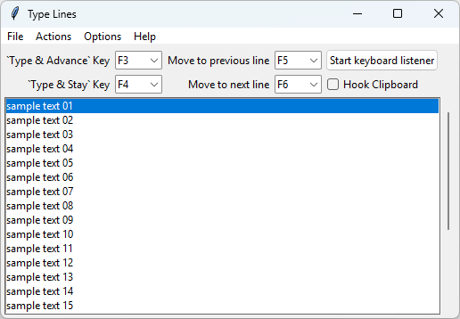
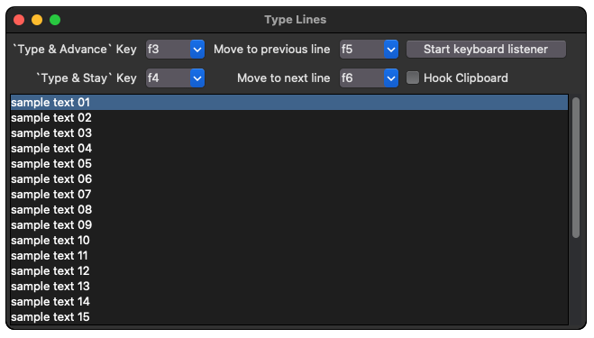

# Type Lines


## Info

`Type Lines` is a python program to use a dedicated macro key (F1 to F20) to type or copy from a list one line at a time. The list can be populated from a template file, the system clipboard, or manually. This functionality can be useful for repetitive or frequently used tasks.


## Features

- Compatible on multiple platforms
    - Windows: all features
    - Linux: missing macro key suppression
    - macOS: all features
- Create a text list and paste the text line by line using a macro key.
- Text list can be populated from a text file via the import option.
- Text list with variables can be populated from a text file via the import option.
  - Variables can contain a list of defaults.
  - User is prompted to select or enter the values or the variables.
  - Any mention of the variables inside `{}` characters are swapped.
- Text list can be populated by the system clipboard.
- Text list can also be added one line at a time manually via insert line.
- Text list will cycle back around to the top after the last command which makes it easy to paste a commands on a many devices.
- This program was created to replace another software I was depending on but which has not been updated since 2010 or 2012: 
  - [ClipCycler](https://sourceforge.net/projects/clipcycler/).


## Screenshots







## Installing

### Windows

Download `typelines.py` or `typelines.pyw` from here. Also download the `requirements.txt` file which is used to install the 3rd party modules [`pynput`](https://pypi.org/project/pynput/) and [`pyperclip`](https://pypi.org/project/pyperclip/).

Install Python from Python.org and install the required modules found in the `requirements.txt` file using the following steps: 

Open `cmd` in the same folder as `requirements.txt` and type
```
pip install -r requirements.txt
```

or simply install the required packages directly with the following command:
```
pip install pynput pyperclip
```

Use `typelines.pyw` if you don't want to see a command prompt window in the background of the `Type Lines` window.

Run the program by double clicking on the icon. If the "Open with" dialog appears chose Python Launcher (the icon with the rocket).

You can also start the program by importing a file on start by dragging the file to the icon of `typelines.py` or by running `typelines.py` at the command prompt followed by the file as an argument.


### Linux 

Tested on Ubuntu 24.04

Download the `typelines.py` from here. Also download the `requirements.txt` file which is used to install the 3rd party modules [`pynput`](https://pypi.org/project/pynput/) and [`pyperclip`](https://pypi.org/project/pyperclip/).

Most Linux distribution already have Python included. If not, install Python from your package manager or compile it from source.

It is recommended to use a virtual environment ([venv](https://docs.python.org/3/library/venv.html)).

Use pip to install the required packages:

```
pip3 install -r requirements.txt
```

or simply install the required packages directly with the following command:

```
pip3 install pynput pyperclip
```

Depending on your display server, you will use either the `xorg` or `uinput` pynput keyboard backend. The program will check the environment variable `XDG_SESSION_TYPE`. If it returns `x11` the backend will be `xorg`. If it is `wayland` the backend will be `uinput`. If it is not set the backend will be `uinput`. If you wish to force one of the backends you can specify it using a command line option such as `--backend xorg` or `--backend uinput`. 

The `xorg` backend requires an X11 display server or a program running in XWayland mode. If this condition is not met, the keyboard listener will not work.

The `uinput` backend requires either running as `root` or adding the permissions to the user to control the keyboard. For more information about adding settings for the user see [this post](https://github.com/moses-palmer/pynput/issues/568). Or use the following commands:

#### Adding uinput group

1. Add user to group input to gain access to /dev/uinput and to group tty to gain access to dumpkeys

```
sudo usermod -a -G input $USER
sudo usermod -a -G tty $USER
```

2. Add udev rule

```
echo 'KERNEL=="uinput", MODE="0660", GROUP="input"' \
    | sudo tee /etc/udev/rules.d/99-uinput.rules
```

3. Activate it!

```
sudo udevadm trigger
```

4. Automatically load uinput module on boot

```
echo "uinput" | sudo tee /etc/modules-load.d/uinput.conf
```

Another issue is with the `_uinput.py` module inside of `pynput` version 1.7.7 itself. If the program is not sending the line as expected it might be because it is sending extra escape or control characters. This affects ANSI keyboards. ISO keyboards might have better luck. 

Modify line 208 of `_uinput.py` as follows and also add a closing end parenthesis `)` after line 208. Because we are modifying a Python package this is good reason to use a virtual environment as a virtual environment will only modify the package in that virtual environment:

Before:
```python
    def __init__(self):
        def as_char(k):
            return k.value.char if isinstance(k, Key) else k.char
        self._vk_table = self._load()
        self._char_table = {
            as_char(key): (
                vk,
                set()
                    | {Key.shift} if i & 1 else set()
                    | {Key.alt_gr} if i & 2 else set())
            for vk, keys in self._vk_table.items()
            for i, key in enumerate(keys)
            if key is not None and as_char(key) is not None}
```

After:
```python
    def __init__(self):
        def as_char(k):
            return k.value.char if isinstance(k, Key) else k.char
        self._vk_table = self._load()
        self._char_table = {
            as_char(key): (
                vk,
                set()
                    | {Key.shift} if i & 1 else set()
                    #| {Key.alt_gr} if i & 2 else set())  # <-- this line commented out
                    )  # <-- This line added closing )
            for vk, keys in self._vk_table.items()
            for i, key in enumerate(keys)
            if key is not None and as_char(key) is not None}
```

The location of the file might be somewhere like this: 

`~/venv/python3.12/lib/python3.12/site-packages/pynput/keyboard/_uinput.py`

The keyboard is not being suppressed on Linux. For example, if the `Type & Advance` key is set to `F3` the `F3` key will be received by `Type Lines` but also any other program which is in focus. The result is you may have extra characters typed before the line is typed or a program's menu might open. If your intended use of this program is the serial terminal program Minicom, you can edit the Macro keys settings from within Minicom and set the function keys to send a space key.

If you are using `Type Lines` with the keyboard backend `uinput` and nothing seems to be typing, it might be due to a conflicting program using the `evdev` package or the wrong keyboard device being assumed. You can start the program with the `-d` or `--detect-keyboard` option to launch a window which prompts you to press the `ENTER` key. This will ensure the keyboard you are typing on is the one selected. Please see the [uinput is not working](#issues) item in the Issues section of this page for more information.

Download the script and set the permissions to executable before trying to run it.


### macOS

Tested on macOS 15 Sequoia

Download the `typelines.py` from here. Also download the `requirements.txt` file which is used to install the 3rd party modules [`pynput`](https://pypi.org/project/pynput/) and [`pyperclip`](https://pypi.org/project/pyperclip/).

Download Python from Python.org and install it. Don't use the version of Python that comes with macOS as it has issues with TCL/TK.

Install the required modules found in `requirements.txt`. From the command line you can do this with 

```
pip3 install -r requirements.txt
```

or simply install the required packages directly with the following command:

```
pip3 install pynput pyperclip
```

For keyboard macro key typing to work you will have to modify some security settings. Search for `Allow assistive applications to control the computer` or go into `Security & Privacy` > `Privacy` and add applications to the following sections.

The sections include:

- Accessibility (For controlling the keyboard and typing)
- Input Monitoring (For listening for keyboard events)

The applications include:

- Python.app
    - /Library/Frameworks/Python.framework/Versions/3.12/Resources/Python.app
- Terminal

Other sections might include:

- Automation
- Developer Tools

Other applications might include:

- IDLE.app
- Python Launcher.app
- /usr/local/bin/python3
- /bin/zsh
- /bin/bash

You will probably have to disable the default behavior of the Function Keys or they will send a command to dim the display or turn the volume down instead of the keycode needed. Look for Apple > System Settings... > Keyboard > Keyboard Shortcuts... > Function Keys > Use F1, F2, etc. keys as standard function keys.

You might want to view the [Platform limitations](https://pynput.readthedocs.io/en/latest/limitations.html#macos) page of pynput's documentation website for tips.


If you wish to run the program as `root`. You can use the command 

```
sudo -E python3 ./typelines.py
```

I do not have access to an Apple computer so I am unable to verify. However, without changing the security settings, the program can still be used to store a list and copy and paste from it.


## Running the program

The program starts with some sample text added to the list.

Test that the program is working. Open a text editor (other than Windows 11 Notepad [see [Issues](#issues)]). Click the `Start keyboard listener` button (on macOS the keyboard listener is started when the program launches as it will crash if launched afterwards). Click the `Type & Advance` key (default is `F3`). If it types the text, it is working.

Create a file to import. Use any text editor to create a list. An example file is below in the [Examples](#examples) section and also found in the folder `example_import_templates`. Use the `File` > `Import template or file` menu option to import your file.

If you import a file without variables, it populates the list area without any further prompts. If you import a file with variables, another window will appear allowing you to specify the values for the variables specified in the template.

After you import a file with variables and enter the values of the variables, it can be saved for later with the `File` > `Save list to file` menu option. Although, it will not store the VARs section or prompt for those variables again.

If you want to add many lines without using a text file, you can hook the clipboard. Then anything you copy is added to the type list. Don't forget to unhook it, or you might be surprised more things are added to the list.

You can manipulate the lines in the list using the `Actions` menu. Actions include copying the selected item, copying the selected item and selecting the next item in the list, editing the selected item, inserting an item before or after the current selection, moving the current selection up or down, and deleting the current line or all the lines.

You can also set some options using the `Options` menu such as skipping comment lines when using `Type & Advance`, allowing blank lines when importing a file, and reversing the direction of `Type & Advance`.

You can right click on an item to bring up the `Actions` menu.

You can view the keyboard backend and program version using the `Help` menu.

You can see the command line arguments available by typing the program named followed by `-h` or `--help`. One notable option is to import a template or file on program start.


## Mouse and Keyboard bindings

Some useful mouse and keyboard bindings to know include:

- Mouse
    - Double click on an item to copy it
    - Triple click on an item to edit it
    - Right click on an item to bring up the actions menu

- Keyboard
    - ENTER will copy the item to the clipboard and select the next item in the list
    - DELETE will remove the selected item from the list
    - UP will select the item above the currently selected item
    - DOWN will select the item below the currently selected item
    - CTRL-ENTER will toggle the keyboard listener
    - CTRL-E will open the edit selected item dialog
    - CTRL-I will open the insert after selected item dialog
    - CTRL-O will open the import dialog
    - CTRL-S will open the save dialog


## Issues

1. Please see pynput's webpage on [Platform limitations](https://pynput.readthedocs.io/en/latest/limitations.html).

2. Typing is really slow or does not complete the whole line on Windows

If you are using Windows 11 Notepad this will happen. I've noticed Windows 11 Notepad has issues with its keyboard buffer. Try using Notepad++ or another program.

3. Keyboard backend `uinput` is not working

Some other programs might fight for keyboard access and cause issues. For example, if you have a Logitech mouse or keyboard and use the program `solaar`, `Type Lines` program will not work. Use the command `python3 -m evdev.evtest` and you might see solaar registering as an evdev-uinput device.

```
11  /dev/input/event11  solaar-keyboard  py-evdev-uinput
```

Either uninstall solaar or quit solaar. Verify by running the command again the solaar item was removed from the list.

If that does not resolve the issue, you can try running the program with the `-d` or `--detect-keyboard` option. A window will open before the program starts and ask you to press the `ENTER` key. It will use the device that sent this event as the keyboard. This should eliminate any possibilities that another device is being used.

4. Program crashes on Linux using Python 3.13

There is an [open issue](https://github.com/moses-palmer/pynput/issues/620) causing the exception `TypeError: '_thread._ThreadHandle' object is not callable`. The solution is to use an older version of Python such as Python 3.12 for now.

5. Keyboard is not working on Linux with `xorg` backend

If running wayland, verify your application you are trying to type into is using XWayland. You can install an application called `xeyes`. If your program is XWayland, the eyes will move when the mouse cursor is inside the window. If not, the eyes will do nothing. The program is usually in the package `x11-apps`. On Ubuntu or a Debian based distro you can use this command to install it: `apt-get install x11-apps`


## Acknowledgements

Thanks to this [post](https://github.com/moses-palmer/pynput/issues/170) and this [Microsoft webpage](https://docs.microsoft.com/en-us/windows/win32/inputdev/virtual-key-codes) keyboard suppression is working on Microsoft Windows.


## Examples

### Example import file with variables

Filename: `example_with_vars.txt`
```
## VARS
## A variable line must start with `##var:` follow by a name
## The variable name must start with a letter or an underscore
## The variable can contain numbers after the inital character
## The variable can only contain the characters a-zA-Z0-9_
## Notice: After the varname, delimiter can be = or :
## Optional, you can specify a list of default values
##var:first_name=Mike,Steve,John
##var:last_name=Jones,Smith,White
##var:fav_number
##var:fav_color:blue,yellow,green,red
##var:not_used

## Comment lines with two or more `#`s are not imported
## Comment lines with one `#` are imported
## There is an option to skip over comment lines when typing (default=True)

## This comment line will **not** be imported
# This comment line will be imported
#this comment line will be imported also

## Put the variable inside `{}` characters
## You can add notation like `:0>3` to add leading zeros or other formatting
## The formatting rule must be for strings (not ints or floats)
## For more info please see: https://docs.python.org/3/library/string.html#format-specification-mini-language

Hello {first_name} {last_name}

Favorite color is: {fav_color} 

Favorite numer is {fav_number}

Favorite number with leading zeros and 5 digits: {fav_number:0>5}

Below is first name and last name centered by spaces 40 digits each
{first_name: ^40}{last_name: ^40}

Below is first name right aligned and last name left aligned by underscores 40 digits each
{first_name:_>40}{last_name:_<40}

Below is first name left aligned and last name right aligned by dashes 40 digits each
{first_name:-<40}{last_name:->40}

The item named not_used was not used.
```
