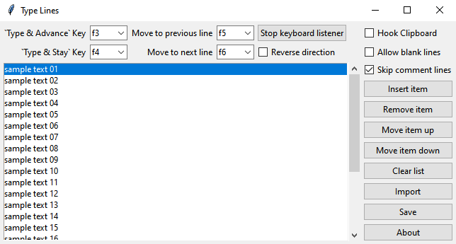
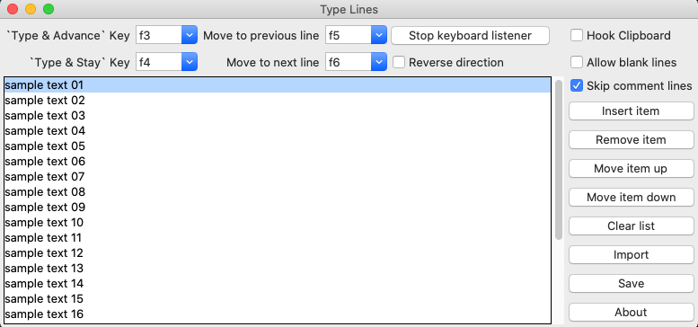
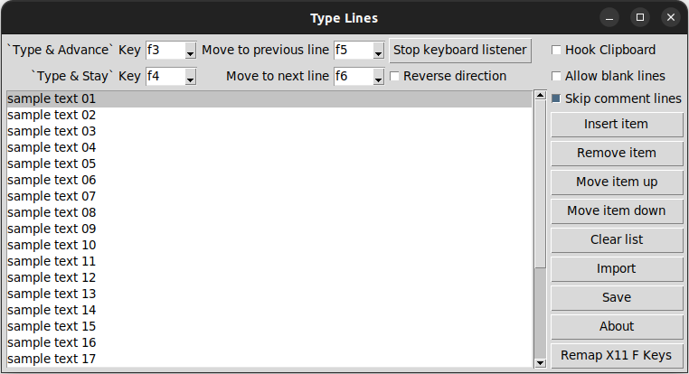

# Type Lines

## Info

`Type Lines` is a cross platform python program to use a dedicated function key to type from a list one line at a time.


## Features

- Cross platform compatible application (Windows, Linux, and macOS)
- Create a text list and paste the text line by line using a hotkey.
- Type list can be populated from a text file via the import option.
  - Variables can be within the text file plus a list of defaults.
  - User is prompted to select or enter the values or the variables.
  - Any mention of the variables inside `{}` characters are swapped.
- Type list can be populated by the system clipboard.
- Type list can also be added one line at a time manually via insert line.
- The list will cycle back around to the top after the last command which makes it easy to paste a commands on a many devices.
- This program was created to replace another software I was depending on but which has not been updated since 2010 or 2012: 
  - [ClipCycler](https://sourceforge.net/projects/clipcycler/).

## Screenshots







## Installing and Running

Install [Python](python.org) if you do not already have python.

Download the `typelines.py` from here. Also download the `requirements.txt` file which is used to install the 3rd party modules [`pynput`](https://pypi.org/project/pynput/) and [`pyperclip`](https://pypi.org/project/pyperclip/).

I would put the python file in a directory where I also plan on keeping my list files so that I don't have to navigate around much when using the import file option.

Launch the program. If it opens in IDLE, click `Run` > `Run Module`.

Test the program out. Open a text editor. Click the `Type & Advance` key (default is `F3`). If it types the text, it is working.

Create a file to import. Use any text editor to create a list. 

An example file is below with variables. After you enter the values of the variables, it can be saved for later with the save option.

If you want to add many lines without using a text file, you can hook the clipboard. Then anything you copy is added to the type list. Don't forget to unhook it, or you might be surprised more things are added to the list.


## Platform Specific Notes


### Windows

Just install Python from Python.org and install the required modules found in the `requirements.txt` file using the following steps: 

Open cmd in the same folder as `requirements.txt` and type
```
pip install -r requirements.txt
```

Rename `typelines.py` to `typelines.pyw` to hide the command prompt window.


### Linux 

Tested on Ubuntu 22.04

Linux support is limited to X11 or a program running XWayland. If you are running Wayland, one workaround could be to run your program in Firefox which at the moment runs as XWayland (you can verify this with the program `xeyes`(install with `sudo apt install x11-apps`). For example, if you want to run a terminal, you could use a program like [ttyd](https://github.com/tsl0922/ttyd) to run a terminal inside of Firefox.

To view which display server you are currently running, try this command:

```bash
echo $XDG_SESSION_TYPE
```

The output should be either `x11` or `wayland` 

Also, the keyboard is not being intercepted on Linux as it is on Windows and macOS. The workaround being offered is to use the `Remap X11 F Keys` option in the program to map the function key to one that does not exists. For example remap `F3` to `F13`. The remap option uses the program `xmodmap`. It can be installed on Ubuntu with the package `x11-xserver-utils`. Restart the program after remapping the keys.

You'll also need to install the required modules found in `requirements.txt`. From the command line you can do this with 
```
pip3 install -r requirements.txt
```


### macOS

Download Python from Python.org and install it. Don't use the version of python that comes with macOS as it has issues with TCL/TK.

You'll also have to go into `Security & Privacy` > `Privacy` and add some applications to `Input Monitoring`, `Accessibility`, `Automation`, and/or `Developer Tools`. These applications might include `Terminal`, `IDLE.app`, `Python Launcher.app`, and `Python.app`.

I disabled `System Integrity Protection`, but I don't really think that is needed. 

You'll also need to install the required modules found in `requirements.txt`. From the command line you can do this with 
```
pip3 install -r requirements.txt
```

Run the program as `root`. You can use the command 
```
sudo -E python3 ./typelines.py
```


### Issues

Please see pynput's webpage on [Platform limitations](https://pynput.readthedocs.io/en/latest/limitations.html).

I tested on macOS in a virtual machine running macOS Catalina Version 10.15.7.  However, it runs intermittently. I believe this is due to pynput's keyboard listener not being trusted by macOS. I cannot nail down the settings needed to run this on macOS and have basically given up.

Also, I implemented one hack because the function keys were not being recognized as their proper values. This hack may or may not work on your machine. If you have feedback, please send it my way.


## Examples

### Example import file with variables

Filename: `example_with_vars.txt`
```
## VARS
## A variable line must start with `##var:` follow by a name
## The variable name must start with a letter or an underscore
## The variable can contain numbers after the inital character
## The variable can only contain the characters a-zA-Z0-9_
## Notice: After the varname, delimiter can be = or :
## Optional, you can specify a list of default values
##var:first_name=Mike,Steve,John
##var:last_name=Jones,Smith,White
##var:fav_number
##var:fav_color:blue,yellow,green,red
##var:not_used

## Comment lines with two or more `#`s are not imported
## Comment lines with one `#` are imported
## There is an option to skip over comment lines when typing (default=True)

## This comment line will **not** be imported
# This comment line will be imported
#this comment line will be imported also

## Put the variable inside `{}` characters
## You can add notation like `:0>3` to add leading zeros or other formatting
## The formatting rule must be for strings (not ints or floats)
## For more info please see: https://docs.python.org/3/library/string.html#format-specification-mini-language

Hello {first_name} {last_name}

Favorite color is: {fav_color} 

Favorite numer is {fav_number}

Favorite number with leading zeros and 5 digits: {fav_number:0>5}

Below is first name and last name centered by spaces 40 digits each
{first_name: ^40}{last_name: ^40}

Below is first name right aligned and last name left aligned by underscores 40 digits each
{first_name:_>40}{last_name:_<40}

Below is first name left aligned and last name right aligned by dashes 40 digits each
{first_name:-<40}{last_name:->40}

The item named not_used was not used.
```
